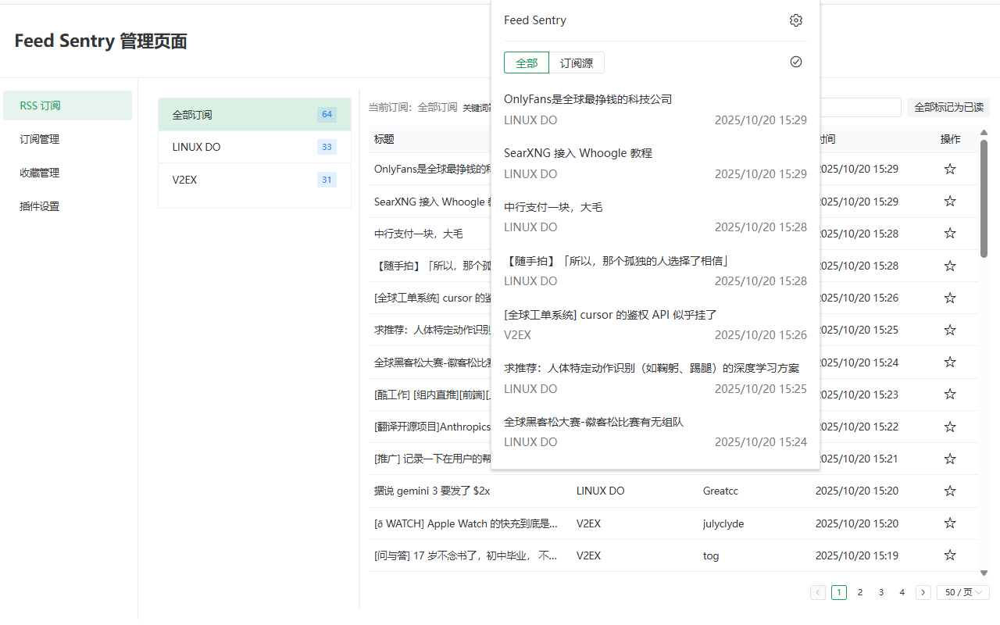
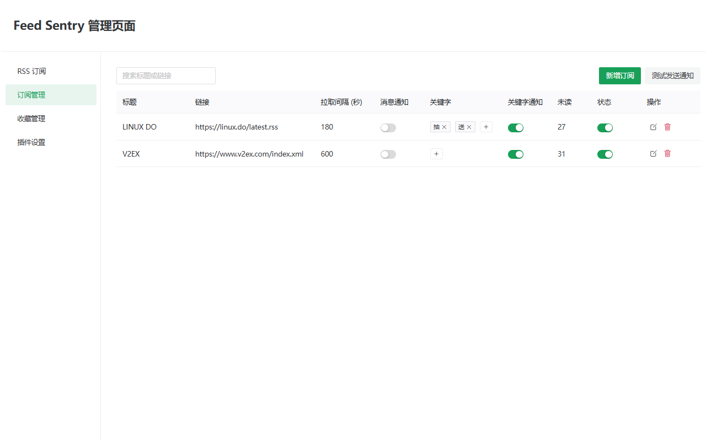
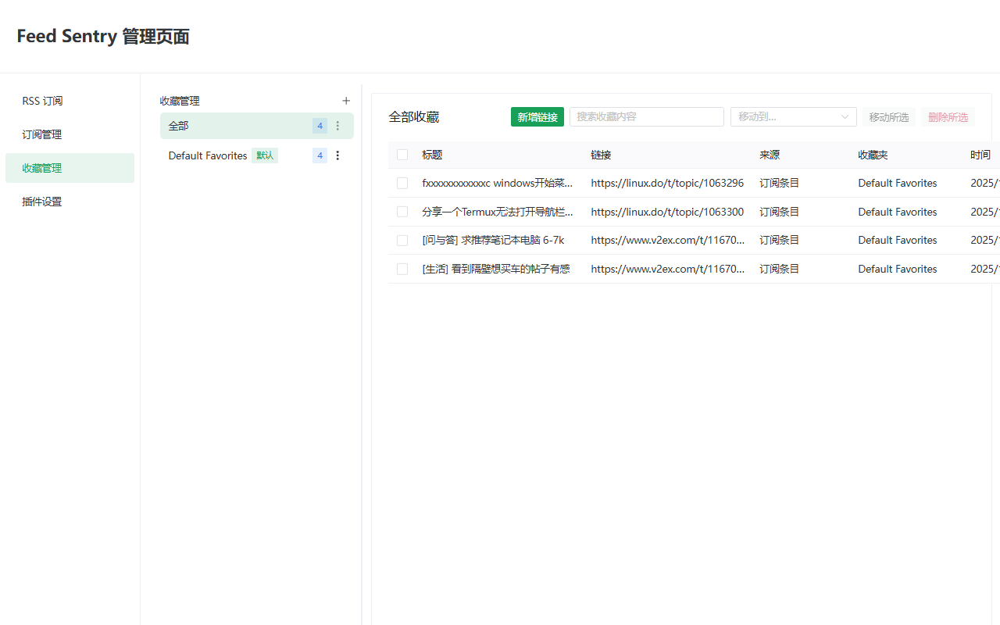

# Feed Sentry

     

简体中文 · [English](README.md)

Feed Sentry 是一款用于跟进 RSS 订阅的极简浏览器扩展。它专注于智能通知、关键字筛选和文件夹式收藏，而不是复刻完整的阅读界面。

## 功能

- **订阅管理**：集中管理多个 RSS 源，可配置轮询间隔、开关通知、批量标记已读。
- **关键字提醒**：按订阅源配置关键字与通知策略，命中条目自动发送系统通知。
- **收藏工作区**：用文件夹整理收藏，支持批量移动或移除，并可手动添加外部链接。
- **主题模式**：支持亮色、暗色与自动模式，可跟随系统主题。
- **国际化**：内置英文与简体中文翻译，自动匹配浏览器语言。

## 示例

快捷弹窗视图



订阅管理页面



收藏管理页面



## 技术栈

- Vue 3 + TypeScript + Composition API
- Vite 7.1.9 + WXT 0.20.11 构建浏览器扩展（Chrome/Edge/Firefox）
- Naive UI 提供界面组件
- Pinia 3.0.3 管理全局状态
- Dexie.js 4.2.1 负责 IndexedDB 数据读写
- Axios 1.12.2 处理网络请求，WebExtension Polyfill 统一浏览器 API

## 发布渠道

- Chrome 网上应用商店：[Feed Sentry](https://chromewebstore.google.com/detail/feed-sentry/lgcccblfifeejkeohoiodggakkcimeio)
- 本地 CRX 安装包（用于手动安装）：`files/chrome_0.1.0_lgcccblfifeejkeohoiodggakkcimeio.crx`

## 快速开始

### 前置条件

- Node.js ≥ 20（推荐与项目 `@types/node` 对齐）
- npm（仓库默认使用 `package-lock.json`）
- Chrome / Edge（Chromium）或 Firefox 浏览器

### 安装依赖

```bash
npm install
```

### 开发

- Chrome / Edge：
  ```bash
  npm run dev
  ```
  WXT 会启动开发服务器，并在终端输出临时扩展目录路径。打开浏览器扩展管理页面，开启开发者模式，选择“加载已解压的扩展程序”，指向该临时目录即可热重载调试。

- Firefox：
  ```bash
  npm run dev:firefox
  ```
  命令会自动调用 Firefox Developer Edition（或已配置的浏览器）并加载临时扩展，保存代码即可触发热重载。

### 构建

```bash
npm run build
```

构建完成后，可在 `dist/{chrome-mv3,firefox-mv3}` 目录中找到对应浏览器的打包结果，用于上传或手动加载。若需生成压缩包，执行：

```bash
npm run zip
```

## 项目结构速览

```
src/
├─ entrypoints/   # background、options、popup 入口
├─ components/    # 复用组件（列表、弹窗、设置面板等）
├─ services/      # 数据层与业务逻辑（Dexie、收藏、订阅等）
├─ stores/        # Pinia 状态管理
├─ composables/   # 通用组合式函数
├─ locales/       # 国际化资源（英文 / 简体中文）
└─ utils/         # 工具函数（高亮、语言处理等）
```
