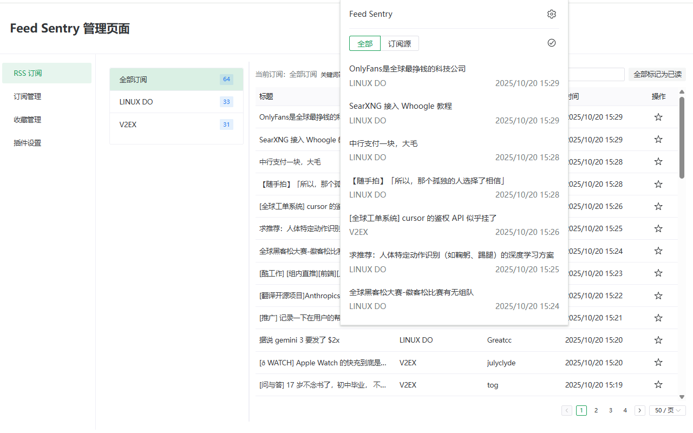
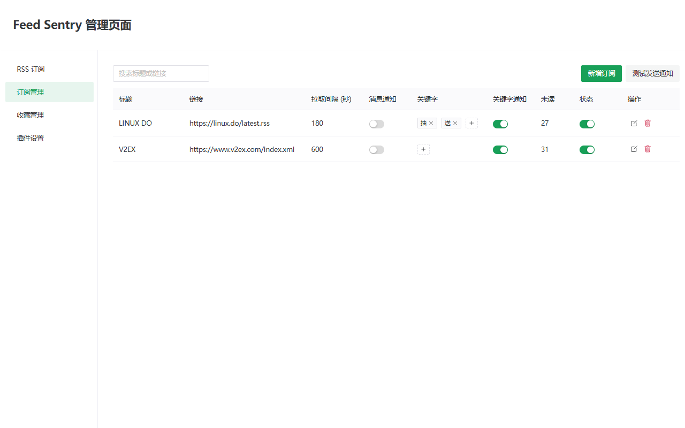
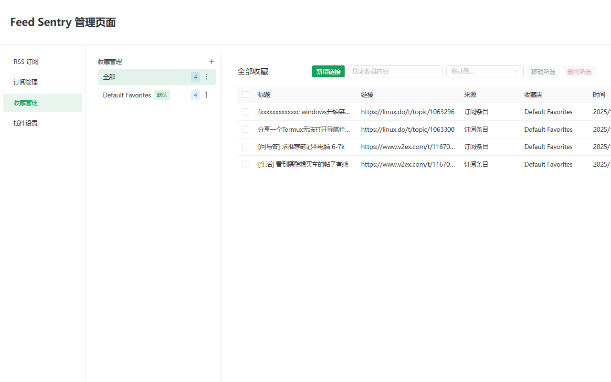

# Feed Sentry

     

English · [简体中文](README-zh-CN.md)

Feed Sentry is a minimalist browser extension for staying on top of RSS feeds. It focuses on smart notifications, keyword filters, and folder-based favorites instead of replicating a full reading interface.

## Features

- **Subscription Management**: Centralize multiple RSS feeds, configure polling intervals, toggle notifications, and mark entries read in bulk.
- **Keyword Alerts**: Define per-feed keywords and notification strategies; matching entries trigger system notifications automatically.
- **Favorites Workspace**: Organize saved links with folders, batch move or remove items, and add external links manually when needed.
- **Theme Modes**: Support light, dark, and auto modes with system theme detection.
- **Internationalization**: Built-in English and Simplified Chinese translations with automatic browser locale matching.

## Demo

Popup quick view



Feed management



Favorites management



## Tech Stack

- Vue 3 + TypeScript + Composition API
- Vite 7.1.9 + WXT 0.20.11 browser extension tooling (Chrome / Edge / Firefox targets)
- Naive UI component library
- Pinia 3.0.3 for state management
- Dexie.js 4.2.1 for IndexedDB storage
- Axios 1.12.2 for HTTP with WebExtension Polyfill for browser APIs

## Distribution

- Chrome Web Store: [Feed Sentry](https://chromewebstore.google.com/detail/feed-sentry/lgcccblfifeejkeohoiodggakkcimeio)
- Local CRX package (for manual installation): `files/chrome_0.1.0_lgcccblfifeejkeohoiodggakkcimeio.crx`

## Getting Started

### Prerequisites

- Node.js ≥ 20 (align with the project's `@types/node` when possible)
- npm (the repository ships with `package-lock.json`)
- Chrome / Edge (Chromium) or Firefox browser

### Install Dependencies

```bash
npm install
```

### Development

- Chrome / Edge:

  ```bash
  npm run dev
  ```

  WXT spins up a development server and prints the temporary extension directory path. Open the browser's extension management page, enable developer mode, and load the unpacked extension from that path to hot-reload.

- Firefox:

  ```bash
  npm run dev:firefox
  ```

  The command launches Firefox Developer Edition (or the configured browser) with the extension preloaded. Saving code triggers automatic reloads.

### Build

```bash
npm run build
```

Build outputs are available under `dist/{chrome-mv3,firefox-mv3}`. To produce distributable archives, run:

```bash
npm run zip
```

## Project Structure

```
src/
├─ entrypoints/   # background, options, and popup entry files
├─ components/    # shared UI pieces such as lists, dialogs, and settings panels
├─ services/      # data layer logic (Dexie, favorites, feed workflows)
├─ stores/        # Pinia stores
├─ composables/   # reusable composition functions
├─ locales/       # i18n resources (English / Simplified Chinese)
└─ utils/         # utilities (highlighting, locale helpers, etc.)
```
